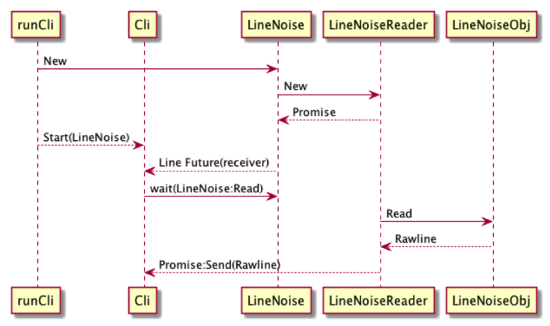

# flowcli
Examples to run the Foundation DB's Flow without dependecy on FDB.  This example is based on the **fdbcli** and the dependency on **fdbclient** is taken out.

## BUILD

The build process is based on FoundationDB's build instrucution for both Linux and MacOS.

* Copy the **flowcli** folder to **foundationdb** folder
* Add **flowcli** the **foundationdb/Makefile** build target, add the following second line to Makefile.

```makefile
CPP_PROJECTS := flow fdbrpc fdbclient fdbbackup fdbserver fdbcli bindings/c bindings/java fdbmonitor bindings/flow/tester bindings/flow
CPP_PROJECTS += flowcli
```
* Under foundationdb folder, run **make targets**, *flowcli* should be listed as one of the targets.
* Run **make flowcli TLS_DISABLED=true**:  *bin/flowcli* should be built and ready to run, **exit** to quit from the CLI.


The key is how to associate the Promise with the Future.  Start a new Future (server thread) whenever there is a new Promise (client).  There is a middle coordinator to help exchanging the promise and future object.  Thus, the sequence is first having coordinator, then promise, then future.  In this example, the objects are:

* Coordinator: LineNoise
* Promise: LineNoiseReader
* Future: Cli


source file for the image at [actor_flowchart.uml](actor_flowchart.uml) 

